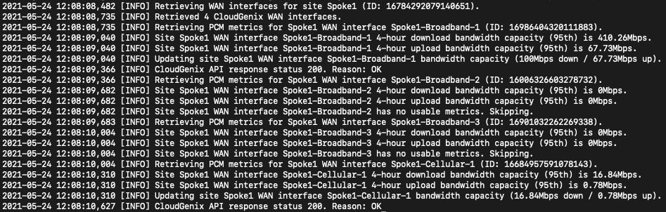

# CloudGenix WAN Bandwidth Management

Currently CloudGenix requires that all WAN circuits within a branch have a manually set bandwidth. This tool leverages the PCM data collected by CloudGenix to calculate WAN circuit capacity and automatically sets the bandwidth values for each circuit based on X interval (default: 4 hours).



## Usage

There are two ways to use this script, either by running it directly or running the docker container.

```
$ python3 run.py -h
usage: run.py [-h] -c CLOUDGENIX_TOKEN [-H 4] [-m 100] [-p 95] [-t Offices] [-v]

optional arguments:
  -h, --help            show this help message and exit
  -c CLOUDGENIX_TOKEN, --cloudgenix-token CLOUDGENIX_TOKEN
                        The API token for authenticating CloudGenix requests.
  -H 4, --hours 4       Number of hours back from current time to calculate metrics for. (default: 4)
  -m 100, --max 100     Maximum bandwidth capacity allowed in Mbps. This creates a ceiling.
  -p 95, --percentile 95
                        Remove data point outliers by setting X percentile. (default: 95)
  -t Offices, --tag Offices
                        Filter spoke sites to those containing the specified tag.
  -v, --verbose         Enable verbose output. Intended for debugging purposes only.
```

## Docker

The latest container image is built on Docker Hub and be downloaded there.

```
$ docker run -e CGX_TOKEN=$X_AUTH_TOKEN -e MAX=100 -e VERBOSE=True synackray/cloudgenix-wan-management
```

The arguments present on the command-line version can be set with environment variables.

| Environment Variable | Required | Type | Default |
|----------------------|----------|------|---------|
| CLOUDGENIX_TOKEN     | Yes      | str  |         |
| HOURS                | No       | int  | 4       |
| MAX                  | No       | int  |         |
| PERCENTILE           | No       | int  | 95      |
| TAG                  | No       | str  |         |
| VERBOSE              | No       | bool | False   |

